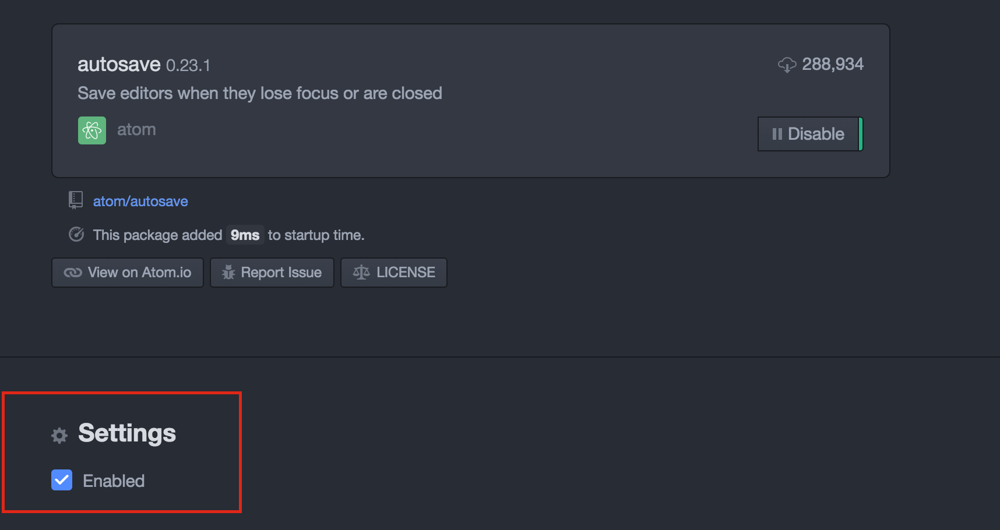
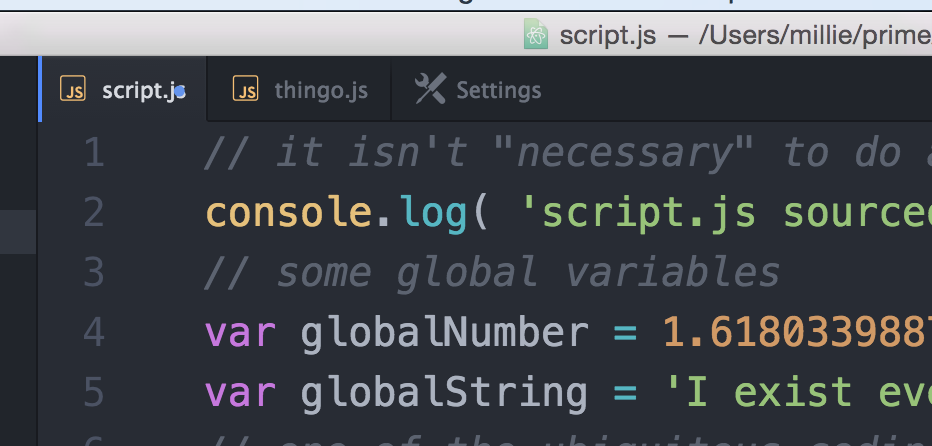
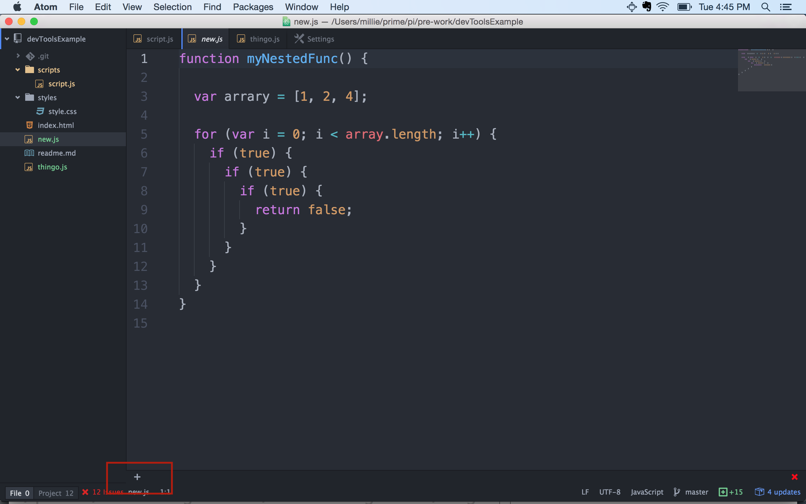
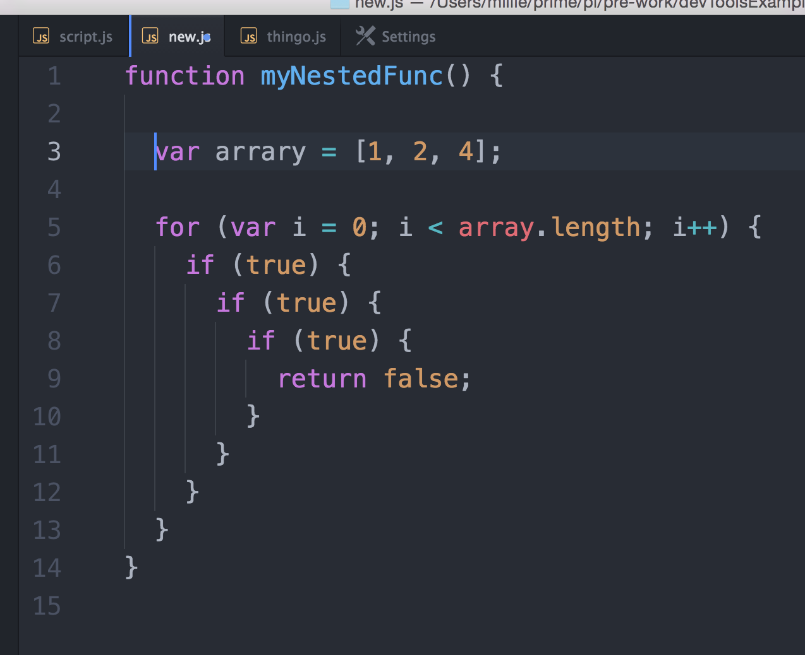
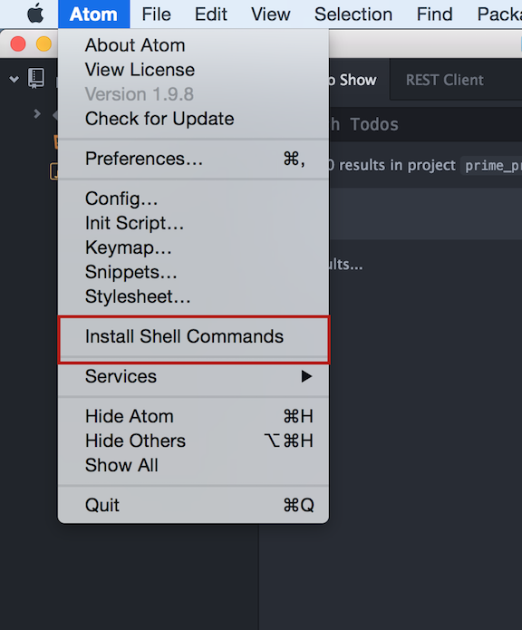

## Atom Install Guide
Follow these steps to get atom setup with the basic packages on your machine.

### Objects 
Install Atom and install a few useful plugins to help you work more affectively.

### Contents
- [Download Atom](#download-atom)
- [Default Functionality / Core Packages](#default-functionality--core-packages)
- [Community Packages](#community-packages)
- [Settings](#settings)
- [Activity](#activity)
- [Hard Mode](#hard-mode) 	

### Download Atom
- Download from here: [https://atom.io/](https://atom.io/)
- After downloading drag the Atom icon from Downloads to the Applications folder. 

- To keep Atom in your doc, right click on the open application item in your doc, select options and keep in doc.

-

### Default Functionality / Core Packages
Atom is the 'hackable text editor'. This means that the community that uses it, extends it via packages they write to add new functionality. As these packages become popular the "maintainers" (programmers that work on and are responsible for a software project) of atom can decide to make functionality default. 

To see what is installed by default or enable it, go to the preferences menu (also called settings). This is located in the Atom menu, select Preferences. A new tab will open called **Settings**. On the left hand side of this screen you should see a series of options: Settings, Keybindings, Packages, Themes, Updates, and Install. Select **Packages**.

The default packages are listed under the **Core Packages** section. Autosave is an example of a core package. This package will save files when they lose focus (i.e. you are looking at another application). First, ensure it is enable on this screen above. Second, click into autosave and you will see it's internal Settings menu and an enable check box. See image below.

Test it is working by making a change to any file. See the blue dot on the file tab, meaning the file is 'dirty' or unsaved (See image below). Open a new file or go to another application, when you come back the blue dot should be gone indicating the file is saved. You can also save files with "command s".

-

### Community Packages

You can install the community packages. Here is a small list of some suggested ones. Note, some packages need you to restart atom before they take effect.

- [platformio-ide-terminal](https://atom.io/packages/platformio-ide-terminal)
- [linter](https://atom.io/packages/linter)
- [linter-jshint](https://atom.io/packages/linter-jshint)
- [minimap](https://atom.io/packages/minimap)
- [file-icons](https://atom.io/packages/file-icons)
- [open-in-browser](https://atom.io/packages/open-in-browser)

There are two ways to install community packages in atom. The first way is described below. If you are interested in installing things via the command line, there is a hard mode below that describes atom package manager (apm).

##### Install from Preferences
In the Preference menu, click **Install** on the left selection. In the search box, type the exact name of the package from the list above. As you see in the picture below many matches come up. Find the correct one and click the blue install button. Again, you might need to restart atom for the package to start working.

I already have installed minimap, so I don't have a blue button. 

Some packages require you launch them from the package menu. 

The terminal you can launch using the small plus button in the bottom left corner of atom. 

-

### Settings 
There are many Settings in the settings tab on the left selection menu when you open up the Preference pane in Atom. Explore these and see if there are any things you want to change. I suggest turning on **Indent Guides**. See picture below to understand what it does. 

This code doesn't do anything useful, but you can see that the indentation and the closing braces are marked with a light gray vertical line. It can be very useful.
 
-
### Activity 
First, install the suggested packages via the Install menu as described above or using apm below. 

Second, do some research on atom packages. Find a cool one (not on the list above) to share with the class tomorrow.

-
### Hard Mode

##### Install using apm (Atom Package Manager)

Apm allows you to easily install packages from the command line (i.e. terminal). After downloading and installing atom, you can install apm by going to the Atom menu and selecting **Install Shell Commands** option.

See the amp github and read me for more information.

[https://github.com/atom/apm]()