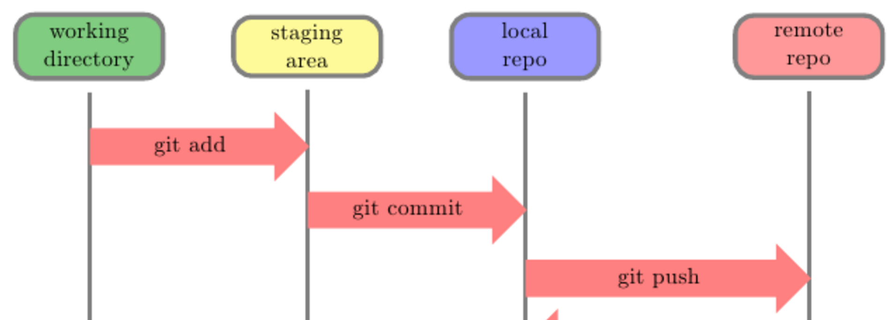

# Git

## What is version control?
One way to think about version control is in the context of some software tool you currently use. Every few months you get a new 'version' of the tool you are using. The code that was written to create the software tool is the same original files, but in this new version some of the files may have been changed to add a new feature or fix a bug (broken code). Git is one of the tools that developers use to be able to facilitate multiple versions of the same code.

### Some other analogies:
- track changes or history in a word or google doc
- a checkpoint in a video game

## Why use version control/git?
- Various version of the same code. To maintain the history. You can go back and view what the code used to look like or even go back in time to fix something the broke.
- As a collaboration tool. When many developers work on the same files it can be complicated and time consuming to combine all the changes. Version control helps developers make changes in parallel and handle conflicts.
- It allows us as developers to take risks (in a controlled way). We can try something, see if it works, and back out of if it breaks something or incorporate it if it works.

### Why git?
The git documentation covers this topic very well [here](https://git-scm.com/about) if you want to more in depth to why git.

## Github vs git
### git
git is a command line tool (in your terminal), that allows us to get all the benefits described above. You can do all you need locally (on your computer) without connecting to the internet. See the [Why git?](#why-git) section for more detail, but it's local capabilities are one of it's main advantages. 

### Github
Github is a web application built on top of git. It adds some additional functionality and some nice UIs (user interfaces) to make things easier to read. The main benefit is it easily helps us collaborate with other developers. We can put our code up on Github and others can collaborate on the project, use our code as an example, or give us feedback on what we are writing.

You may hear people say "remote repository" this is what Github is. A place not on our computer where we can store our code. 

There are other similar services. Github is just one that is popular and we will be using during the workshop.

## Git basics - Commands and theory
We are going to learn five basic command that will get you started with git in your terminal. You will see references to these throughout the curriculum, but feel free to come back to these notes if you need a reminder.

#### Commits
Commits are sets of changes to the code that we can move through to see the history of all the files. They capture what the code looked like at the time of the commit.

#### Workflow Diagram
We will reference this diagram in the descriptions below.



#### git init
This command turns the folder your code is in into a local git repository.

```
$: cd project-folder
$: git init
```
#### git status
This command prints out the current state of your local repository. It will show you the files git is tracking or not, what changes have been made, and what changes are staged for commit. This is a command developers run frequently and inbetween different stages.
 
```
$: git status
```
#### git add
When you are happy with a change (or changes) you need to move them to the staging area. Files in the staging are in green when you run the ```git status``` command. All staged changes will be included in your next commit.

#### git commit -m 
Like mentioned earlier, a commit a snapshot of the code at that time. This command takes the staged changes and makes that snapshot. The command also takes a message that describes the changes being committed.

```
$: git commit -m "useful message describing the change"
```
#### create a remote and link to remote repository
Instructions for how to do this can be found [here](https://help.github.com/articles/adding-an-existing-project-to-github-using-the-command-line/). Github will give us some additional commands to link the local with the remote repository. For now copy and paste these to set up tracking.

#### git push
Now the changes are in the local repository, it is time to put them on the remote repository to share the code you wrote (with a friend!). This command will do that!

```
$: git push
```

## More Resources
- [git documentation](https://git-scm.com/doc)
- [Github Cheat Sheet](https://services.github.com/kit/downloads/github-git-cheat-sheet.pdf)
- [Visual Git Cheat Sheet](http://ndpsoftware.com/git-cheatsheet.html)
